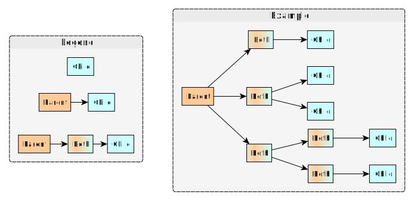
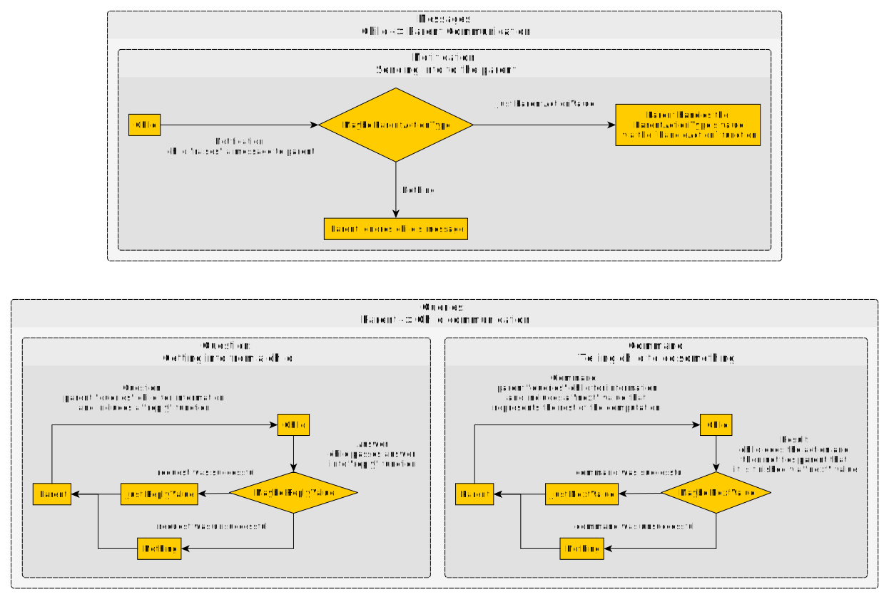

# Parent-Child Relationships

## How to Read This Folder

This page provides an overview of parent-child relationships in 4 parts:
1. Capability-based components
2. rendering childlike components
3. parent-child communication
4. slot addresses

Here's how to read this folder's contents:
1. Read Section 1: Capability Based Components
2. For Sections 2 - 4
    1. Read the section in this file
    2. Read through the section's corresponding files in the "child-like components" folder
3. For Sections 2 - 4
    1. Read the section in this file
    2. Read through the section'scorresponding files in the "parent-like components" folder

## Capability-Based Components

Halogen does not distinguish a "child" component from a "parent" component. Rather, one should think of components as having capabilities that are "child-like" and/or "parent-like." For example, "child-like" components can do X and Y, but not Z. In reality, all components are configured to have "child-like" capabilities, "parent-like" capabilities, or both capabilities.

For example


A "parent" component can
- render other components (it's children)
- query one of more of its children
    - by "requesting" information (e.g. "Could you tell me your counter's state?")
    - by "telling" it/them to do something (e.g. "Increase your counter by 1")

These are a few examples of "parent" components:
- a container-like component that lays out child components in a specific way
- a coordinator component that syncs state between multiple child components

A "child" component can
- respond to its parent component's queries:
    - requests: "My counter's state? Oh, it's 4"
    - tells/commands: "Ok. I will increment my counter by 1"
- notify a parent component of an event by "raising" a message (e.g. "Hey parent! I was clicked!")

A component that has both "parent" and "child" capabilities
- has all the "parent" capabilities
- has all the "child" capabilities
- can forward its parent's query down to its children
- can forward its children's messages to its parent

## Rendering

The corresponding files for this section: `Input-Only`

### Initial Rendering

When a "parent-like" component renders a "child-like" component, sometimes the "child-like" component's initial state and initial rendering is always the same across program runs. In other words, we can hard-code these values. When the parent renders the child, the child does not need any information from the parent.

In other cases, the initial state of the "child-like" component might depend on information the "parent-like" component has. In other words, these values are different when we run the code multiple times.

For example, a "parent-like" component (e.g. a layout pane) might know what the "current user" is. This user will change across program runs, so we cannot hard-code the initial state of the "child-like" component (the avatar part of the user's profile page). Rather, the parent-like component should pass this information into the child-like component.

To accomplish this, a parent can pass into a child a value of the `Input` type. For example


A child can do one of three things with that value:
1. Ignore it:
    - `\_ -> hardCodedInitialState`
    - `const hardCodedInitialState`
2. Use the `Input` value as it's initial `State` value:
    - `\x -> x`
    - `identity`
3. Do something more custom depending on what it is:
    - `\x -> if isEmpty x then "some default value" else x`

We define this mapping in the `initialState` part of our code.

### Each Re-Render Thereafter

After the initial rendering, if the parent ever re-renders itself (due to its state being changed), it will only pass a value of the `Input` type into the child if that value has changed since the last time it passed such a value. Sometimes, the child will want to respond to such changes, and other times it won't.

Thus, a child-like component responds to a parent's `input` value just like an event:
1. Determine via `Maybe` whether to handle the "event" (i.e. parent was re-rendered and is passing a new value of `Input` into the child-like component)
2. Convert the event into a value of the child's `Action` type.
3. Handle that action value.

We define this mapping in the `receive` part of our code.

## Parent-Child Communication

There are 2 kinds of communication (based on who initiates the conversation) but 3 communication possibilities:
1. messages (child -> parent):
    - Child "raises" a message about something to its parent.
2. queries (parent -> child):
    - Parent "requests" information from child
    - Parent "tells" child to do something

In simple terms, Halogen models their communication in this way:



### Child to Parent Communication

The corresponding files for this section: `Message-Only`

A child cannot know which parent may contain it, but a parent will always know which child it wraps. When a child wishes to notify the parent that something has occurred, it "raises" a message to the parent. We use the `Message` type for this.

If we reuse the child component across multiple unrelated parent components, each might handle it differently.

Thus, a parent responds to a child's message just like an event:
1. Determine via `Maybe` whether to handle the "event" (i.e. child message)
1. Convert the "event" into a value of the parent's `action` type.
2. Handle that parent's `action` value.

In other words, we use a function with this type signature: `ChildMessageType -> Maybe ParentActionType`.

### Parent to Child Communication

The corresponding files for this section: `Query-Only`

When a parent executes a query, it notifies the child and includes a "callback" of sorts, either a "reply" function or a "next" value.
- **"reply" function:** think of this as a pre-paid return package. The parent will be running some computation and then need information from one or more of its children. Thus, it "mails" the child some instructions and a pre-paid return package. The child uses the information the parent provides and then puts the information the parent requested into the package. That package gets "mailed" back to the parent. Once received, the parent continues its computation with this additional information.
- **"next" value:** think of this as a timer that goes off, indicating that an activity is finished. The parent will be running a computation. Then, the parent will tell one of more of its children to do something and wait for it to finish that activity. The child will receive the command and do the action. Then, the child will notify the parent that it's finished. Once the parent receives the notification, the parent continues to run its computation.

In code, we would write the child's query type like this:
```purescript
-- Usually, you'll see `theRestOfTheParentComputation` as `a`
-- but this is how you should read it.
data Query theRestOfTheParentComputation
                         -- This is what the 'reply' function looks like
  = RequestInfoFromChild (InfoParentNeeds -> theRestOfTheParentComputation)
                              -- This is what the 'next' value looks like
  | CommandChildToDoSomething theRestOfTheParentComputation
  -- Here are some real-life examples
  | UpdateStateIfNeeded InfoChildNeeds1 InfoChildNeeds2 theRestOfTheParentComputation
  | RequestInfoFromChild InfoChildNeeds3 (InfoParentNeeds -> theRestOfTheParentComputation)
```

## The Problem of Multiple Children and the Solution of Slot Addresses

The corresponding files for this section: TODO

Let's say a parent-like component has one child-like component. Answers to the following questions are obvious:
- Which `query` type should we use to communicate with the child?
- When the child raises a message, how should we map that message to a parent action?
- With which child in particular are we communicating?

However, when a parent has two or more children, we cannot give obvious answers to the questions above. Rather, complicated situations can arise.
- **The "Slot Query" problem:** Two or more children may use diffrent `query` types, so which `query` type's value do we use when communicating with Child A instead of Child B?
- **The "Slot Message" problem:** Two or more children may use different `message` types to raise/emit messages to the parent. How does the parent correctly map each one to the parent component's `action` type?
- **The "Slot Index" problem:** Two or more children may use the `same` query type, so which of those children do we query?
- **The "Slot Label" problem:** The above three problems allow all sorts of different combinations, so how does the parent track one combination from another?

For languages that don't have a powerful type checker, these kinds of problems can lead to runtime errors and tracking down the bugs become difficult.

For Halogen, a `slot` type solves each of the above problems, and the compiler guarantees that no such problem exists or it fails with a compiler error.

A `slot` consists of four things:
- the "query" type that that child type uses
- the "message" type that the child type uses
- the "index" type that the parent type uses to distinguish one child from another when all use the same query and message type
- the "label" in a record that the parent uses to refer to each combination of the above three things

In short it looks like this:
```purescript
type SingleChildSlot =
  ( labelForCombination :: H.Slot ChildQuery ChildMessage IndexForSameQuerySameMessage )
```
When we want to have more combinations, we just add another label:
```purescript
-- One "slot label" for each query-message-index combination
type ChildSlots =
  ( labelForCombination :: H.Slot ChildQuery ChildMessage IndexForSameQuerySameMessage
  , label2 :: H.Slot ChildQuery2 String Int
  , label3 :: H.Slot GetOrSetChildState String Int
  , logMessages :: H.Slot NoQuery NoMessage Int
  )
```
Since Halogen uses one component type and does not distinguish a child-like component from a parent-like component, child-like components must also define their `ChildSlots` type. So how do we define a slot type with no chlid slots? We ues an empty row kind:
```purescript
type NoChildSlots = () -- this is an empty row kind
```
